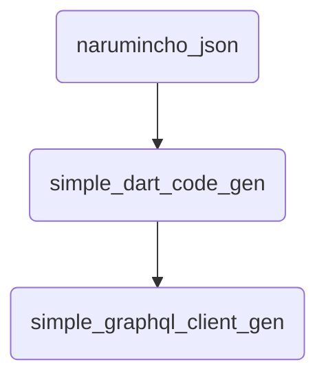

# narumincho's dart-packages

## [narumincho_util](https://github.com/narumincho/dart-packages/tree/main/packages/narumincho_util)

## [narumincho_json](https://github.com/narumincho/dart-packages/tree/main/packages/narumincho_json)

## [simple_dart_code_gen](https://github.com/narumincho/dart-packages/tree/main/packages/simple_dart_code_gen)

## [simple_graphql_client_gen](https://github.com/narumincho/dart-packages/tree/main/packages/simple_graphql_client_gen)

